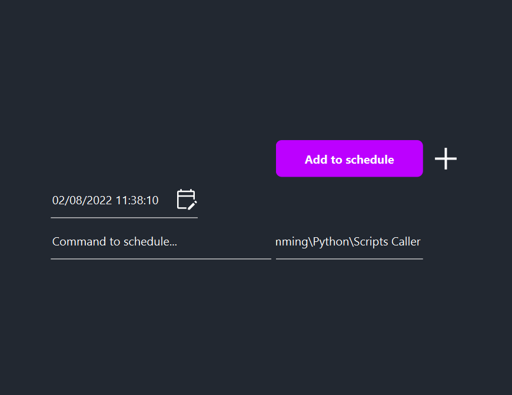
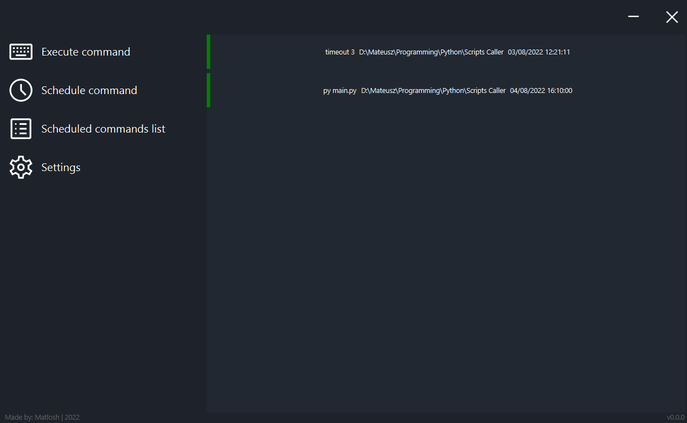
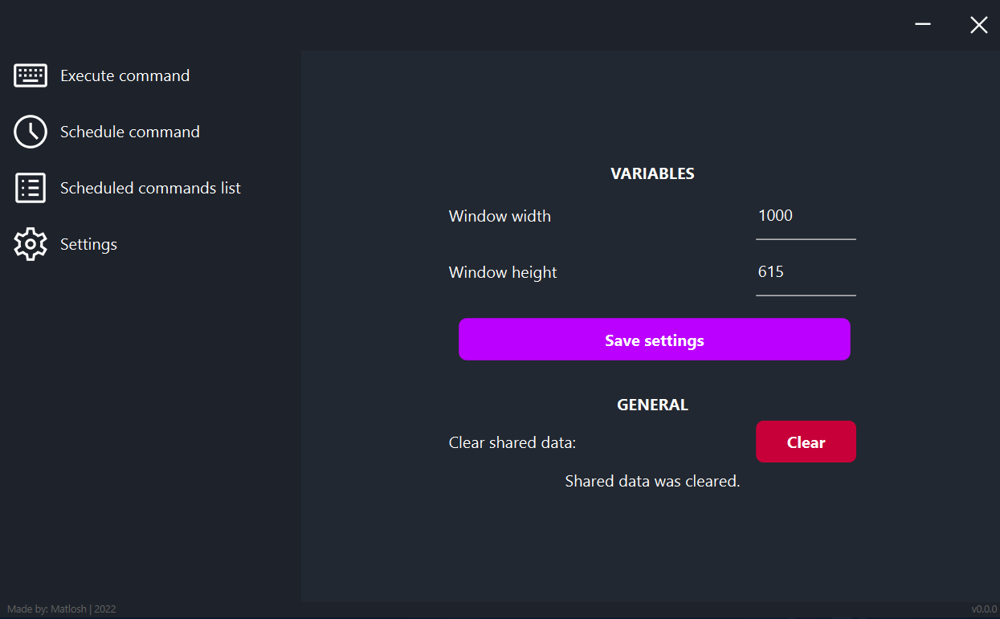

# Scripts Caller
*Activating random jumpscare script at specific time? Now it is possible!*

## About
Scripts Caller is an application made in Python (and using PySide6 library) to easily execute and schedule execution of various python scripts, cmd commands or similar. Application also provides simple list to check when scripts should be (or were) fired.

## Usage
To turn on the application simply use:
```
py main.py
```

## Short guide
### Glance at app's panels
After turning on the application a window should appear:


**Topbar** contains: minimizing and exit button

**Menu** (panel on the left side) contains: four buttons (more detailed explanation below)

**Content** (panel in the middle/on the right side): changes depending on the chosen option from the menu

**Footer** contains: app's author, creation date and current version

### Menu and it's options
Currently menu contains four elements:


To change app's content simply click any of the menu options.

### Brief description of the available options

**Execute command** - allows to execute one or more commands one after another or all at the same time.

GUI contains: 
- "Execute all at once" button - changes whether all given scripts or commands should be executed all at once (if not checked then all scripts/commands will be executed one after another)
- "Execute" button - simply starts execution process
- "+" button - adds new line to execute another script or command
- "Command to execute" input - in that input script or command that has to be executed should be written
- "Execution path" input - that input should contain - for example - path of the script that has to be executed (if command or script doesn't need a path - it is some sort of system command or similar - this input doesn't need to be changed and can be left as it is at the start)


**Schedule command** - allows to schedule one or more commands to execute at the set time.

GUI contains:
- "Add to schedule" button - adds the given script(s) or command(s) with their settings to the schedule list
- "+" button - adds new line to enter new script or command and set their schedule settings
- "Date and time" input - that input sets planned script's or command's execution time
- "Command to execute" input - (same as in the "Execute command" option)
- "Execution path" input - (same as in the "Execute command" option)



**Scheduled commands list** - shows all scheduled commands, path and their planned execution time.

GUI contains:
- Each scheduled command's entry - consisted of (starting from the left):
  - red or green color - red means that scheduled script should have already fired and green that script will run
  - "Command to execute" - command that will be or was executed
  - "Execution path" - path where script or command will be or was executed
  - "Execution date and time" - date and time when script or command will be or was executed


**Settings** - allows to change few available app's settings.

GUI contains:
- Header of the elements in the settings
- Actual settings (which contents may differ depending on the things that have to be changed)


### Working in the background
After clicking "_" (minimize) button, app would be hidden - meaning that it can't be accessed through the 

## Requirements
Libraries that are needed to successfully run the application are listen in the *requirements.txt* file.

## Gallery - usage examples

### Execute command's "one after another" mode usage example
Below scripts are executed one after another and each script execution can be easily stopped by clicking red "x" button. **Note that script or command will automatically go to the next if execution has ended.**


### Execute command's "all at once" mode usage example
Below scripts are executed all at once and scripts can be easily stopped individually by clicking red "x" button. **Note that red "x" button will disappear near the script's or command's row that has already ended.**


### Schedule command's usage example
Below screenshot adds two commands (one is system command and the second is Python's script execution) at the two different dates.


### Scheduled command's list usage example
Below screenshot shows two planned entries (created on the above screenshot).



### Settings' usage example
Below screenshot shows settings after clicking "Clear" button to clear all the saved shared data.



## Icons
All icons used in the application were taken from the [https://fonts.google.com/icons](https://fonts.google.com/icons) website.

## Note
Application has been fully tested on the Windows OS and few functions may not be working on the UNIX based OS.

## Application state
**Application is fully interactive, all added elements should be working and there can be bugs. Application can still receive updates in the future which will add new elements, repair bugs and similar.**